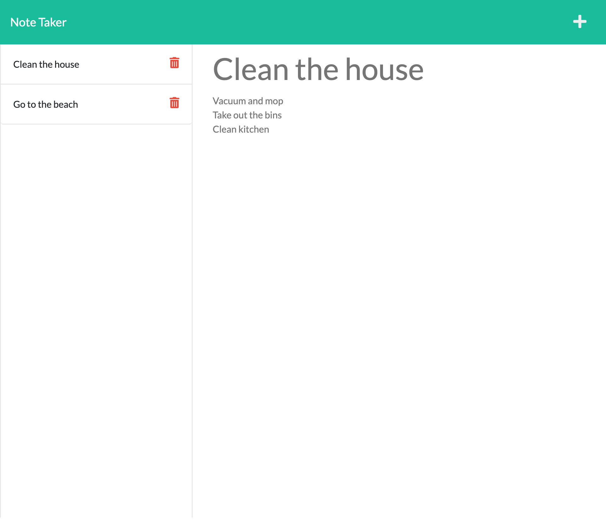

# note-taker

## Table of Content 
- [note-taker](#note-taker)
  - [Table of Content](#table-of-content)
  - [Description](#description)
  - [Installation](#installation)
  - [Usage](#usage)
  - [Contributing](#contributing)
  - [License](#license)
  - [Questions](#questions)

## Description
This application is a helpful tool to help you save notes and plan your tasks. In this application I used HTML, CSS, JS, NODE.JS and Express.js.

## Installation
- copy ssh keys 
- git clone {paste}

## Usage
To use this note-taker application, you type the note in the title area and your description for that note underneath. You can save them by clicking the top right save card and it will appear in the left hand side of your application. Furthermore if you would like to delete this note you simply click the red bin on the right of your note. 

You can find this application [here](https://your-note-taking.herokuapp.com/)

## Contributing
Sam Ngu.

## License 
This project is under No license.

## Questions
If you want to contact me or have any questions you can visit my [Github](https://github.com/njenkins2727)
or if you have any further questions you can also send me an email: njenkins2727@gmail.com
